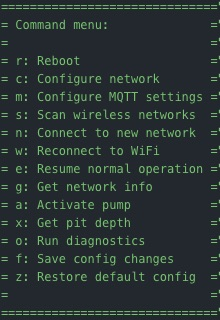

# CySump

[](https://travis-ci.com/cyrusbuilt/CySump)

ESP8266-based automated IoT sump pump system (Arduino).

The code in this repository represents the Firmware for the CySump IoT sump pump controller device, as well as some components for integrating with [OpenHAB2](https://openhab.org).  CySump is a [PlatformIO](https://platformio.org/) project and is meant to integrate with an existing sump pump and provide 2 things: The ability to detect state (the system's state, pump state, and pit state {water level}) and the ability to control the pump MQTT. Since there is an [ESP8266](https://www.adafruit.com/product/2471) at the heart of it, that means it is WiFi-enabled and is capable of OTA (Over-the-Air) firmware updates.

## Important Note on Security

CySump uses [MQTT](http://mqtt.org/) to pass control messages in JSON format and in turn the device sends status messages in JSON format to MQTT subscribers (such as OpenHAB2). Additionally, these messages are transferred to/from MQTT over TLS using SSL certificates so that the messages are encrypted.  You cannot send control messages to CySump directly. You have to publish them to the control channel on the MQTT broker that CySump is subscribed to. Additionally, you would need the appropriate certificate and SHA256 fingerprint to connect to and publish the control messages. This security architecture is certainly not infalible, but definitely adds a strong layer of security that was non-existent in previous versions and also provides some means of hardening that security even further (such as using certificates signed by an RSA CA (as opposed to self-signed certs) and using password authentication with the MQTT broker on top of that. You can even configure OpenHAB2 to communicate with the MQTT broker using TLS as well, although this is overkill if the broker is running on the same machine as OpenHAB2 and/or the MQTT standard port is bound to the OpenHAB2 host).

## Theory of Operation

The way this is intended to work is: when the device detects the water level in the pit is at a certain level (at least 40% full by default), it turns on the pump via a relay and when the water level drops back down to at least 5% (by default) it shuts the pump off. If for some reason, the water level reaches roughly 83% full (about 5 inches from the water surface to the top of the pit), then the piezo buzzer will turn on and will not turn back off until the water drops below the alarm threshold. If using the OpenHab2 components, then a push notification will be sent when the water level reaches roughly 80% full and then again if the pit actually floods. The idea is not only to be able to control the pump, but alert the user to critical water level and flood conditions. Ideally, this detection and alert mechanism could be used to minimize or prevent damage.

## Configuration

The config.h file contains default configuration directives. These options are the hardcoded default values that the system will initially boot with. However, if there is a config.json file present in the root of the SPIFFS file system, then it will override these defaults. Here we'll discuss each option:

- ENABLE_OTA: If you do not wish to support OTA updates, just comment this define.
- ENABLE_MDNS: If you do not wish to support [MDNS](https://tttapa.github.io/ESP8266/Chap08%20-%20mDNS.html), comment this define.
- PIT_DEPTH_INCHES: The depth of the pit in inches. Or more importantly, the distance between the sensor and the bottom of the sump pit. Default is 30.
- ALARM_DEPTH_INCES: This is the *remaining* depth to consider the sump pit to be critical. This is the distance (in inches) from the sensor to the water surface. Default is 5 inches (remaining before flooding).
- CONFIG_FILE_PATH: This is the path to the configuration file. The default is /config.json. The values in this file will override these defaults.
- DEFAULT_SSID: Change this line to reflect the SSID of your WiFi network.
- DEFAULT_PASSWORD: Change this line to reflect the password to your WiFi network.
- CLOCK_TIMEZONE: The GMT offset for your timezone (EST [America/New York] is -4 when observing DST. It's -5 when not.)
- SERIAL_BAUD: While it is not recommended, you can change the BAUD rate of the serial port here.
- CHECK_WIFI_INTERVAL: The interval (in milliseconds) to check to make sure the device is still connected to WiFi, and if not attempt to reconnect. Default is 30 seconds.
- CHECK_SENSORS_INTERVAL: The interval (in millisceonds) to check the water depth.
- CLOCK_SYNC_INTERVAL: The interval (in milliseconds) to try to resync the clock with NTP. Default is 1 hour.
- DEVICE_NAME: This essentially serves as the host name of the device on the network.
- CHECK_MQTT_INTERVAL: The interval (in milliseconds) to check connectivity to the MQTT broker. If the connection is lost, a reconnect will occur. The default value is 35 seconds.
- MQTT_TOPIC_STATUS: The MQTT status topic to publish device status messages to. Default is 'cysump/status'.
- MQTT_TOPIC_CONTROL: The MQTT control topic to subscribe to for control messages. Default is 'cysump/control'.
- MQTT_BROKER: The hostname or IP of the MQTT broker.
- MQTT_PORT: The port on the MQTT broker to connect to. The default is 8883 (default port for MQTT over TLS).
- OTA_HOST_PORT: Defines the port to listen for OTA updates on. This option is ignored if ENABLE_OTA is disabled.
- OTA_PASSWORD: The password used to authenticate with the OTA server. This option is ignored if ENABLE_OTA is disabled.
- ip: The default IP address. By default, this devices boots with a static IP configuration. The default IP is 192.168.0.202. You can change that here if you wish.
- gw: The default gateway address. The current default is 192.168.0.1. You can change that here if you wish.
- sm: The subnet mask. By default, it is 255.255.255.0, but you can change that here if need be.

To override the default configuration options, you need to upload a filesystem image containing a file named 'config.json' in the root of the SPIFFS filesystem. The file should like something like this:

```json
{
    "hostname": "CYSUMP",
    "useDHCP": false,
    "ip": "192.168.0.202",
    "gateway": "192.168.0.1",
    "subnetMask": "255.255.255.0",
    "dnsServer": "192.168.0.1",
    "wifiSSID": "your_ssid_here",
    "wifiPassword": "your_password_here",
    "webserverPort": 80,
    "otaPort": 8266,
    "otaPassword": "your_ota_password_here",
    "mqttBroker": "your_mqtt_broker_here",
    "mqttPort": 8883,
    "mqttControlChannel": "cysump/control",
    "mqttStatusChannel": "csump/status",
    "mqttUsername": "your_mqtt_username",
    "mqttPassword": "your_mqtt_password",
    "serverFingerprintPath": "/mqtt.fpn",
    "caCertificatePath": "/ca.crt"
}
```

This configuration file is pretty self explanatory and one is included in the source. The file *MUST* be located in the "data" directory located in the root of the project in order to be picked up by the flash uploader (either via Serial or OTA). Each of the options in the configuration file are self-explanatory and match up with the hard-coded default settings mentioned above. If this file is not present when the firmware boots, a new file will be created and populated with the hardcoded defaults. These defaults can then be changed via the fail-safe menu and saved. You'll notice a couple of additional options in the config.json file not present in config.h. They are as follows:

- mqttUsername: If you have enabled password authentication on your MQTT broker, provide the username here.
- mqttPassword: If you have enabled password authentication on your MQTT broker, provide the password for the username above. If *both* the username and password are provided, then CyGarage will attempt to connect to the broker with the provided credentials; Otherwise, it will attempt to connect without credentials.
- mqttControlChannel: The MQTT control topic to subscribe to in order to receive device commands.
- mqttStatusChannel: The MQTT status topic to publish device status to.
- serverFingerprintPath: The path to the file containing the MQTT broker's SHA256 fingerprint. Default is '/mqtt.fpn'.
- caCertificatePath: The path to the CA certificate that the MQTT broker's certificate was signed with. Default is '/ca.crt'.

If the above values are omitted or invalid, then the system will fail during loadCertificates() and will not be able to connect to MQTT.

## Getting Started

After you've configured everything the way you need it (as discussed above), build the firmware by either clicking "Build" in the PlatformIO tasks menu, or by opening a terminal to the project directory and typing:

```bash
> platformio run
```

NOTE: The first time you flash the Huzzah, you need to do so over serial (since the OTA code isn't there yet), but subsequent uploads can be done via OTA if configured properly.

The next thing to do is connect the Huzzah to your computer using an FTDI cable like [this one](https://www.adafruit.com/product/70?gclid=EAIaIQobChMIm7-50ZiZ5AIVlIvICh284QPxEAQYBCABEgJkcPD_BwE) and then configure the port in platformio.ini like so:


With the above mentioned FTDI cable attached to my MacBook, the port appears as it does in the config file above (usually PlatformIO is pretty good about auto-detecting the port for you).

Now all you have to do is flash the firmware onto the Huzzah. You can do this by first pressing and holding the "GPIO" button and then press the "reset" button and let go of both on the Huzzah to put it into flash mode (this is not necessary when you flash via OTA), then click the "Upload and Monitor" task in the PlatformIO menu or by typing the following into the terminal:

```bash
> platformio run --target upload
> platformio device monitor --baud 115200 --port /dev/cu.usbserial-AL05HSL2
```

Once complete, press the "reset" button on the Huzzah. You should see the device boot up in the serial console. Now put the device back into flash mode. If you are using MQTT over TLS (recommended) then visit the readme in the "openhab" folder (even if you ultimately are not connecting MQTT to OpenHAB) for instructions on generating the necessary files for connecting CySump to MQTT, otherwise just click the "Upload File System Image" task in the PlatformIO menu. When finished, press the "reset" button again and the device will reboot and come back up with your new configuration settings.

## OTA Updates

If you wish to be able to upload firmware updates Over-the-Air, then besides leaving the ENABLE_OTA option uncommented, you will also need to uncomment all the upload_* lines in platformio.ini, and change the line 'upload_port = ' line to reflect the IP of the device and the line '--auth=' to reflect whatever OTA_PASSWORD is set to. Then when you click "upload" from the PlatformIO tasks (or if you execute 'platformio run --target upload' from the command line) it should upload directly over WiFi and once completed, the device will automatically flash itself and reboot with the new version. If you wish to upload a new configuration file, you can also do this via OTA. Assuming the above-mentioned settings are configured, you can then click "Upload File System Image" from the PlatformIO project tasks.

## Serial Console Menu

If the device ever fails to connect to WiFi or if you press the 'I' key on your keyboard while in the serial console, normal operation of the device is suspended and the device will fall into a 'fail-safe' mode and present the user with a command menu. Here we will discuss those menu options:



- Reboot - press 'r' - Self-explanatory. Reboots the device.
- Configure network - press 'c'. Configure the network.

- - Press 'd' for DHCP or 't' for static IP.

- - If static, then you will also be prompted for the IP, gateway, DNS, and subnet mask.

- Configure MQTT settings - press 'm'. You will be prompted for broker hostname/IP and port, control and status topics, and authentication credentials.

- Scan wireless networks - Press 's'. This will scan for available wireless networks and dump a table of the networks it found to the console.

- Connect to new network - Press 'n'. This option prompts the user for a new SSID and password for different WiFi network to connect to.

- Reconnect to WiFi - Press 'w'. This can be used to reconnect to the current WiFi network if the connection was lost.

- Resume normal operation - Press 'e'. This will leave fail-safe mode and attempt to resume normal operation by resuming any suspended tasks and verify network connectivity.

- Get network info - Press 'g'. This will dump network information to the serial console (IP config, WiFi connection info).

- Activiate pump - Press 'a'. This allows the user to manually activate the pump.

- Get pit depth - Press 'x'. This lets you get the current depth reading (without triggering any alarm states). Useful for determining the actual depth for configuration.

- Run diagnostics - Press 'o'. This will run a self-test, checking the input and output componets, network functionality and communication with MQTT broker.

- Save config changes - Press 'f'. This will save any configuration changes currently stored in memory to config.json.

- Restore default config - Press 'z'. This will restore the firmware configuration back to the factory default settings (the hard-coded defaults). It does this by simply deleting the existing config.json file from flash storage and then immediately rebooting the firmware. Upon reboot, a new config.json file is created and populated with the default settings which are then applied to the running configuration in memory.

## Dependencies

The firmware dependencies will be installed automatically at compile-time.  However, if you wish to install dependencies prior to compiling (for intellisense or to clear warnings/errors in the VSCode editor) you can run the following command:

```bash
> platformio lib install
```

Then go to the platformio menu and click "Rebuild IntelliSense index".

## Tools

Included with this firmware is a few handy tools:

- /disassemble.sh - Disassembles the compiled firmware into a plain text file called 'disassembly.txt'. If the firmware has not been built, it will be compiled first, then disassembled. The disassembly output contains the assembly code, C++ calls, and instruction addresses useful for debugging the executing code or determining the cause of crashes at addresses reported by ESPCrashMonitor during boot.

- tools/clear_flash.sh - Completely clears the flash memory on the ESP8266 of all data (including firmware).

- tools/serial_monitor.sh - Just runs the serial monitor. Pretty much the same as clicking 'Monitor' in the platformio menu, but uses its own settings instead of those found in platformio.ini.

- tools/generate_mqtt_certs.sh - Generates the necessary certificates for the MQTT broker and CySump to communicate over TLS.

## Integration with sump pump

Once the board is assembled (either by having the board etched or by just soldering the necessary components to perf board and making the connections manually), you will need to mount the board somewhere and then make the necessary connections to the pump. To do this involves working with high-voltage. *BE CAREFUL DAMNIT*. I am not liable if you do something wrong and injure yourself or blow up your pump. Ok?? Are we clear on this??

Good. I hope so.

For those of you that have done this sort of thing before, this should be trivial. If you don't have any experience with this stuff, please consider having an electrician do the work or at least someone with experience.  The best approach is *NOT* to modify the power cord on your pump. My best recommendation would be to a 3-pronged extension cord, cut it in half and then splice the ground and neutral wires back together be leave at lest a few inches of wire out of the outer sheath. When you splice those wires, use something heavy duty (good wire nuts, solder and shrink tube, or maybe good crimp-on connectors rated for high voltage).

Strip both pieces of remaining 'hot' wire. Connect the 'hot' wire from the male plug to the center terminal of a 3-position toggle switch rated for at least 120VAC @ 10A. Connect the 'hot' wire of the female plug to the NO terminal on the relay. Take another wire of the same guage and connect one end to the NO terminal as well. Take the other end and connect it to one of the other terminals on the toggle switch. When the switch is in the center position, the pump is 'off' and will NOT run. When switched to whatever position that other terminal is, it will be 'manually on'. Now take another wire of the same guage and connect one end to the oposite terminal on the toggle switch and then the other end to the COM terminal on the relay. When switch to this position, the pump will be 'auto', meaning it is controlled by CySump. Ideally, all the switch and wiring will be inside of a proper electrical box with a face plate the switch mounts to. Now connect the male plug to the electrical outlet, and plug the pump into the female end. Test 'manual' mode to verify the pump turns on and nothing bad happens. DO NOT let the pump run for more than a few seconds if there is no water in the pit. You can burn out your pump.

Now you need to mount the HCSR04 sensor. How you do this is up to you and depends on the sump pit. You *should* have a lid on the pit. One option is to glue the sensor to the underside of the lid. Another would be to attach it to a bracket or board that straddles the top of the sump pit. However you choose to do it, keep in mind that the sensor will be exposed to moisture so use a method that will not allow the sensor to become dismounted. Also, it would be ideal to coat or cover the electrical connections and components (except the cans) to prevent corrosion. A future version will use a different sensor for this reason. However you choose to mount it, keep in mind that the depth reported by the sensor will be the total distance from the sensor to the bottom of the pit. It would be worth checking pit depth from the serial console menu ('x' command) once the sensor is mounted and the pit is completely dry. This would give you a definitive baseline depth reading, not just of the depth of the pit, but more importantly, the distance from where the sensor is mounted, to the bottom of the pit. Even though the standard depth is 30 inches, usually there is some gravel or something like that at the bottom and you also have to consider exactly where the sensor is mounted, all of which affect the depth reading. Adjust the value for PIT_DEPTH_INCHES in config.h to reflect that value. But before you can do that, you will need to make a cable of the appropriate length (4 leads) to reach between the sensor and the CySump board. Both ends should have female pin connectors.
