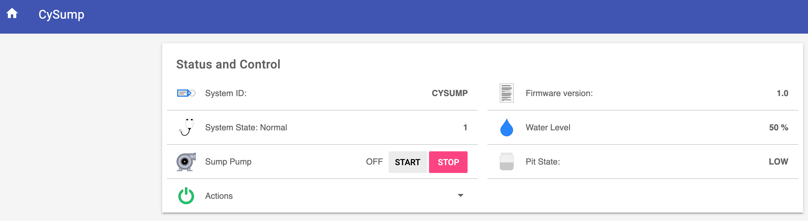
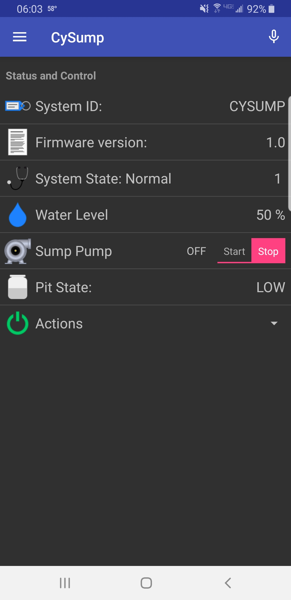
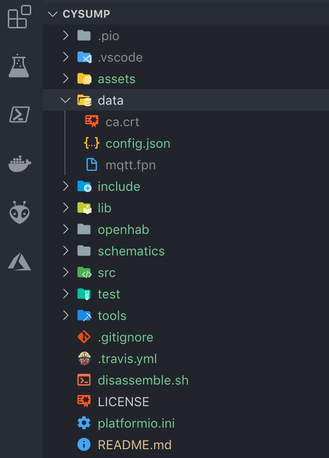

# OpenHAB Components

This directory contains components for integrating with OpenHAB2.

## Instructions for integrating with OpenHAB2

The first thing you will need to do if you haven't already, is install an MQTT broker. For the purposes of this guide, I will assume you will be using [Mosquitto](https://mosquitto.org/) and will be installing it on the same machine as OpenHAB2.

To install mosquitto, follow the download and install instructions [here](https://mosquitto.org/download/). But assuming you are installing on an Ubuntu or Ubuntu-based system just run:

```bash
> sudo apt-add-repository ppa:mosquitto-dev/mosquitto-ppa
> sudo apt-get update
> sudo apt install mosquitto mosquitto-clients
```

## The following instructions are only necessary when TLS is enabled

Next we need to generate the necessary SSL certificates that will be used for communication over TLS.  There is a shell script in the tools directory that simplifies this process. Just run:

```bash
> tools/./generate_mqtt_certs.sh
```

You will first be prompted for the hostname and IP address of your MQTT broker (in this example, it is the same as the your OpenHAB2 server). It will also prompt you for some additional information such as country, state/province, Organizational Unit, org name, etc. It will also prompt you for a password. Make note of this password. When the script is finished it will output a bunch of files in tools/certs. As the script indicates, the ones we are most interested in are host_name.key.pem, hostname_.crt.pem, and ca.crt.pem (where host_name is the host name you provided when the tool first ran). These 3 files need to be copied somewhere on your MQTT server. For this example let's assume /etc/mosquitto/certs.

```bash
> sudo mkdir /etc/mosquitto/certs
> sudo cp -f tools/certs/host_name.key.pem /etc/mosquitto/certs
> sudo cp -f tools/certs/host_name.crt.pem /etc/mosquitto/certs
> sudo cp -f tools/certs/ca.crt.pem /etc/mosquitto/certs
```

## END TLS-SPECIFIC CONFIG

Next, we need to configure it.

```bash
> sudo nano /etc/mosquitto/mosquitto.conf
```

First make sure the following line is present:

```txt
listener 1883 localhost
```

This binds port 1883 (the default non-SSL port) for MQTT to only allow traffic from the local host.  This is done because encrypting the traffic between OH2 and MQTT when they are running on the same host is overkill, but we also need to make sure that *ONLY* the localhost can do this.  All other traffic will then have to go through another port. In our case, 'all other traffic' will be encrypted traffic when TLS is enabled. This means we need to define another port and supply the certificates like so:

```txt
listener 1883 localhost

listener 8883
cafile /etc/mosquitto/certs/ca.crt.pem
certfile /etc/mosquitto/certs/host_name.crt.pem
keyfile /etc/mosquitto/certs/host_name.key.pem
```

If you are *NOT* using TLS, you can simply leave all the certificate lines out of the config (or comment them). Now press CTRL+X to save and close the file.  Now restart MQTT:

```bash
> sudo systemctl restart mosquitto.service
> sudo systemctl status mosquitto.service
```

It should start back up normally and show the status as active. Now lets test it out:

```bash
> mosquitto_sub -h localhost -p 1883 -t cysump/status &
> mosquitto_pub -h localhost -p 1883 -t cysump/status -m "{\"foo\":\"bar\"}"
{"foo":"bar"}
```

You should see the message output. Now you can kill the subscription you created with the first command:

```bash
> fg
```

Now press CTRL+C.

Next, we need to configure OpenHAB to use the MQTT broker. To do this, go to PaperUI -> Addons -> Bindings and install the MQTT Binding.  Once the installation is complete, we need to configure the service:

```bash
> sudo nano /etc/openhab2/services/mqtt.cfg
```

Add the following lines:

```txt
mqtt:localBroker.url=tcp://localhost:1883
mqtt:localBroker.clientId=openhab2
mqtt:localBroker.qos=0
```

Save and close the file.

## Optional password authentication

If you wish to use password authentication with Mosquitto, then there are some additional steps. First, you need to generate the password file.

```bash
> sudo mosquitto_passwd -c /etc/mosquitto/passwd cysump
```

Where "cysump" is the username. You can make this whatever you want as long as this same username is what you put in the CySump config and in the mqttbridge.things file (if you don't already have an existing bridge). Next, we need to modify the mosquitto config again:

```bash
> sudo nano /etc/mosquitto/mosquitto.conf
```

And add the following lines to the file:

```txt
allow_anonymous false
password_file /etc/mosquitto/passwd
```

Save and close, then restart the service:

```bash
> sudo systemctl restart mosquitto.service
```

Next we need to copy the following files to the openhab-conf folder on the server:

## rrd4j.persist

This is a persistence configuration file. This is only needed if you are using RRD4J for the persistence engine in OpenHAB2 and don't already have a persistence file for it (althouh the settings in this file are recommended). NOTE: Peristence is required to make use of historical water depth tracking. If you don't need this feature or are using a different persistence engine, you can ignore this file. Otherwise, copy this file to the openhab-conf/persist directory.

## mqttbridge.things

This is a "Thing" definition for the MQTT bridge. This bridge can be used by anything else in OH2 that needs it. This simply defines a bridge to MQTT that registers OH2 as a client. If a Thing definition for this bridge already exists, no need to copy it again. If not, then copy this file to the openhab-conf/things directory.

## cysump.things

This is a "Thing" definition for CySump that binds the channels we need to MQTT.  You can edit the binding if needed, (such as adding the mosquitto username and password, hostname or IP and port) then copy this file to the openhab-conf/things directory.

## cysump.items

This file defines the items that will bind to the channels in the cysump.things file, which will represent controls and display values. Copy this file to your openhab-conf/items folder.

## cysump.sitemap

This is the sitemap contains all the items defined in the cysump.items file and makes up all the monitor and control items on one screen. Copy this file to your openhab-conf/sitemaps folder.

## cysump.rules

Contains automation logic. This file is responsible for sending push notifications if the pit is getting too full or if it has flooded, and handles the control actions. Copy this file to your openhab-conf/rules folder.

## All set

Now that everything is in place. You need to restart OH2:

```bash
> sudo systemctl restart openhab2.service
```

Now lets make sure the service started successfully:

```bash
> sudo systemctl status openhab2.service
```

The service should be active. So let's test it:

```bash
> mosquitto_pub -h localhost -p 1883 -t cysump/status -m "{\"client_id\":\"test\",\"pumpState\":\"OFF\",\"firmwareVersion\":\"1.0\",\"systemState\":0,\"waterLevelPercent\":50,\"waterDepth\":12,\"pitState\":\"LOW\",\"alarmEnabled\":true}"
```

Now if you navigate to BasicUI in OH2 and click the CySump sitemap, you should see the System ID is "test", Firmware version is "1.0", System State is "Booting 0" and Pump state is "OFF".

CySump Sitemap (Web Version)



CySump Sitemap (OH2 Mobile App Version)



## Dependencies

You will need the following dependent add-ons installed in OpenHAB2 for these components to work correctly:

[openHAB Cloud Connector](https://www.openhab.org/addons/integrations/openhabcloud/)

- You also need to connect your local OpenHAB server to a cloud instance in order to receive push notifications.

This is because cysump.rules makes use of the sendBroadcastNotification() method which assumes you have linked your local OH2 server to a cloud OH2 instance, which can then make use of push notifications. If you do not wish to use push notifications or just don't want to link your local installation to a secure cloud instance, then don't install the cloud connector and comment out the necessary line cysump.rules.

[RRD4J Peristence add-on](https://www.openhab.org/addons/persistence/rrd4j/)

- Required for historical water depth graphs if no other persistence engine is being used.

If all went well, you can now use CySump with your OH2 installation and control and monitor the sump pump (securely) using the OH2 web console or via the OH2 mobile app.

## Finishing up

At this point the only thing left to do if you haven't already is to compile and upload the firmware (if you are happy with the defaults in config.h and your settings in config.json). Next make sure the device is operating normally and you can ping the IP of the device. You can even publish a command to the device to force it to report it's status back:

```bash
> mosquitto_pub -h localhost -p 1883 -t cysump/control -m "{\"client_id\":\"CYSUMP\",\"command\": 4}"
```

The 'data' directory in this project should now contain 3 files: config.json, ca.crt, and mqtt.fpn.



If so, click "Upload File System image" from the PlatformIO tasks and it will upload those files to CySump and it will reboot when finished. Once it comes back up, it should be able to establish a connection to MQTT and you should see it's status in OH2.
